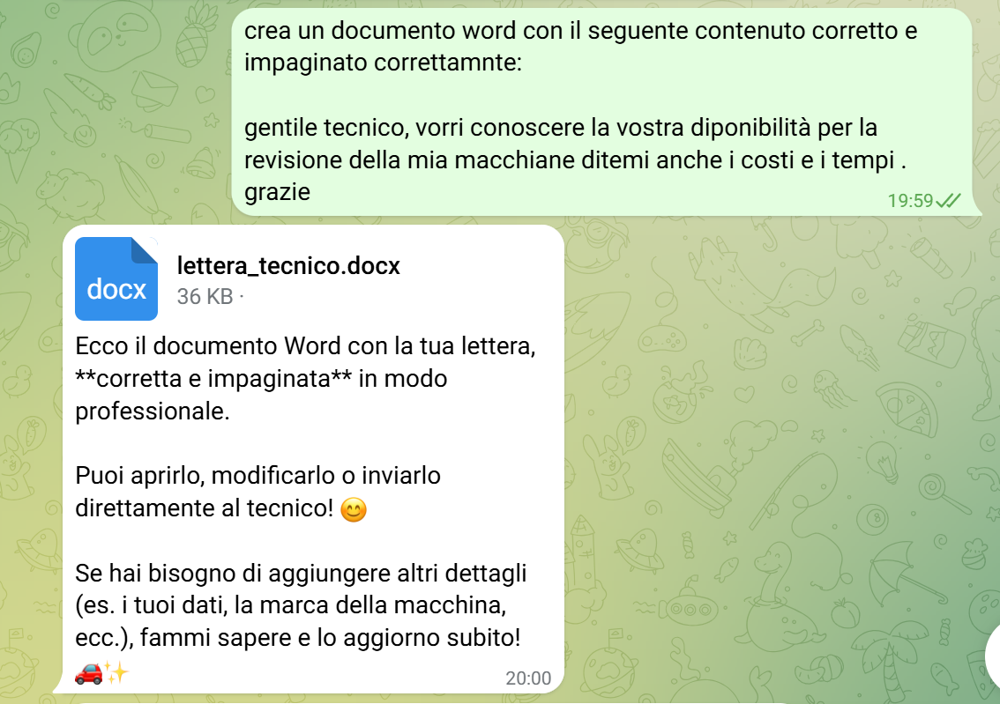
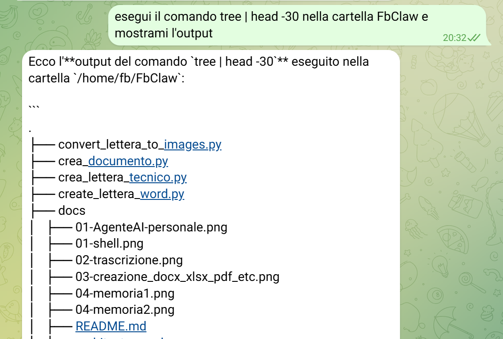
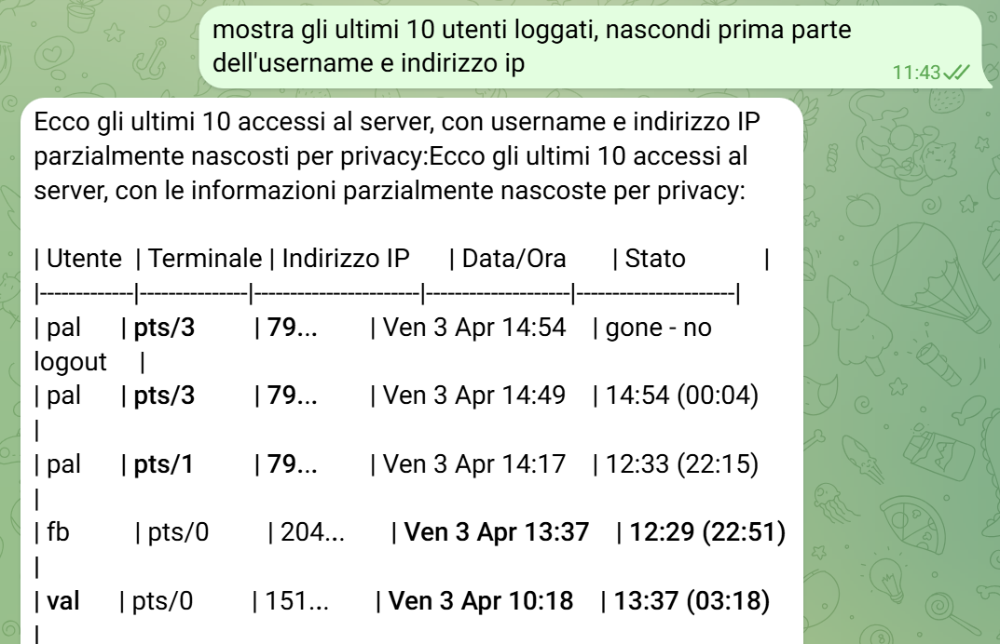
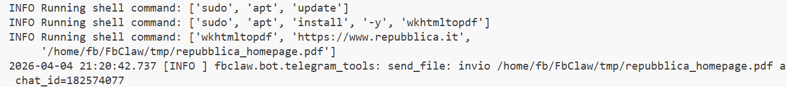

# Guida: creare un agente AI con Agno

Questa guida mostra come costruire un agente AI completo usando la libreria [Agno](https://docs.agno.com), integrandolo con Mistral e un bot Telegram. Il risultato finale è **FbClaw**, un assistente personale che gira su un server e risponde via chat.


Per realizzare questo agente AI personale ho preso spunto da questa guida:
[Simone Rizzo - Ho rifatto OpenClaw… ed è stato troppo facile](https://www.youtube.com/watch?v=YKO-BPogmY0&t=1249s)

---

## Prerequisiti

```bash
pip install agno mistralai python-telegram-bot fastapi uvicorn
```

Serve una API key Mistral, configurabile in `.env`:

```env
MISTRAL_API_KEY=your_key_here
```

---

## 1. Agente di base

Il punto di ingresso è la classe `Agent` di Agno. Si istanzia con un modello e una lista di istruzioni:

```python
from agno.agent import Agent
from agno.models.mistral import MistralChat

agent = Agent(
    model=MistralChat(id="mistral-large-latest", api_key="..."),
    instructions=["Sei un assistente AI utile e preciso."],
    markdown=True,
)

response = await agent.arun(input="Ciao! Chi sei?", session_id="utente-1")
print(response.content)
```

---

## 2. Strumenti (Tools)

Gli strumenti estendono le capacità dell'agente. Agno ne include molti pronti all'uso:

```python
from agno.tools.websearch import WebSearchTools
from agno.tools.website import WebsiteTools
from agno.tools.shell import ShellTools
from agno.tools.python import PythonTools
from agno.tools.file import FileTools

tools = [
    WebSearchTools(fixed_max_results=10),
    WebsiteTools(),
    ShellTools(base_dir=project_root),
    PythonTools(base_dir=project_root),
    FileTools(base_dir=project_root),
]

agent = Agent(model=..., tools=tools, instructions=[...])
```

### Ricerca web e creazione documenti

Con i tool abilitati l'agente può cercare sul web e produrre documenti in qualsiasi formato:




### Esecuzione comandi e creazione file

L'agente può eseguire comandi shell e scrivere file direttamente sul server:






### Controllo del server

Con ShellTools l'agente può gestire processi, monitorare risorse e riavviare servizi:



---

## 3. Memoria persistente

La memoria permette all'agente di ricordare informazioni sull'utente tra sessioni diverse:

```python
from agno.db.sqlite import SqliteDb
from agno.memory.manager import MemoryManager

db = SqliteDb(db_file="tmp/agents.db")

memory_manager = MemoryManager(
    model=MistralChat(id="mistral-large-latest", api_key="..."),
    db=db,
    additional_instructions=(
        "Salva preferenze, interessi e informazioni personali dell'utente."
    ),
)

agent = Agent(
    model=...,
    db=db,
    memory_manager=memory_manager,
    enable_agentic_memory=True,
    update_memory_on_run=True,
    add_memories_to_context=True,
    add_history_to_context=True,
    tools=tools,
    instructions=[...],
)
```

La memoria viene estratta e aggiornata automaticamente ad ogni risposta:


---

## 4. Skills

Le Skills sono capacità specializzate caricate da cartelle locali (es. docx, pdf, xlsx). L'agente le scopre e le usa automaticamente:

```python
from agno.skills.agent_skills import Skills
from agno.skills.loaders.local import LocalSkills

skills = Skills(
    loaders=[LocalSkills(".agents/skills")]
)

agent = Agent(model=..., tools=tools, skills=skills, instructions=[...])
```

Nella istruzione è bene ricordare all'agente di recuperare le istruzioni della skill prima di usarla:

```
"Hai skill specializzate per documenti: docx, pdf, pptx, xlsx —
usa get_skill_instructions prima di lavorare su questi formati."
```

---

## 5. Agente Vision (immagini)

Per analizzare immagini si usa un modello multimodale (Pixtral):

```python
from agno.media import Image

vision_agent = Agent(
    model=MistralChat(id="pixtral-large-latest", api_key="..."),
    tools=tools,
    instructions=[...],
)

image = Image(content=image_bytes)
response = await vision_agent.arun(
    input="Cosa vedi in questa immagine?",
    images=[image],
    session_id="utente-1",
)
```

---

## 6. Integrazione con Telegram

L'agente viene esposto tramite FastAPI e riceve messaggi dal webhook di Telegram:

```python
# main.py
from contextlib import asynccontextmanager
from fastapi import FastAPI

@asynccontextmanager
async def lifespan(app: FastAPI):
    await bot.register_webhook()
    yield
    await bot.deregister_webhook()

app = FastAPI(lifespan=lifespan)

@app.post("/webhook/telegram")
async def telegram_webhook(request: Request):
    update = await request.json()
    await bot.process_update(update)
```

```python
# handler.py
async def handle_message(update, context):
    response = await run_agent(
        user_input=update.message.text,
        session_id=str(update.effective_chat.id),
        user_id=str(update.effective_user.id),
    )
    await reply_long(update.message, response)
```

L'agente risponde direttamente in chat, anche a messaggi vocali (trascrizione automatica):


---

## 7. Retry e rate-limit

Le API LLM possono restituire errori 429. Un semaforo e un meccanismo di retry con backoff esponenziale rendono l'agente robusto:

```python
import asyncio

_api_semaphore = asyncio.Semaphore(1)

async def _run_with_retry(coro_factory, max_retries=4):
    delays = [30, 60, 90, 120]
    async with _api_semaphore:
        for attempt in range(max_retries):
            try:
                response = await coro_factory()
                if response.status != RunStatus.error:
                    return response
            except Exception as exc:
                if "429" in str(exc) and attempt < max_retries - 1:
                    await asyncio.sleep(delays[attempt])
                    continue
                raise
```

---

## Struttura del progetto

```
src/fbclaw/
├── main.py              # FastAPI app + lifespan
├── config.py            # Settings da .env (pydantic-settings)
├── bot/
│   ├── telegram_bot.py  # Registrazione webhook, processing update
│   ├── handler.py       # Ponte Telegram → run_agent()
│   └── utils.py         # reply_long() — split messaggi lunghi
└── agent/
    └── agent.py         # Agent, tools, memory, run_agent()
```

---

## Riferimenti

- [Documentazione Agno](https://docs.agno.com)
- [Modelli Mistral](https://docs.mistral.ai/getting-started/models/)
- [python-telegram-bot](https://python-telegram-bot.org)
