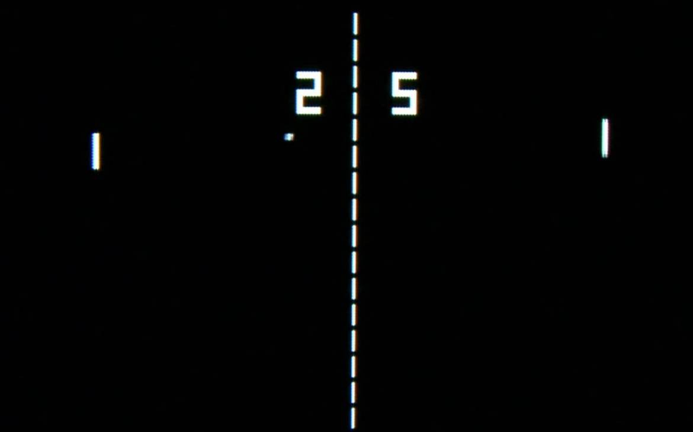

# Guida al Gioco Pong

## Introduzione
Pong è uno dei primi videogiochi arcade della storia, sviluppato da Atari nel 1972. Il gioco simula un tennis da tavolo dove due giocatori controllano delle racchette (paddle) per colpire una pallina avanti e indietro. La sua semplicità e il suo gameplay intuitivo lo hanno reso un classico senza tempo e uno dei pilastri fondamentali della storia dei videogiochi.



*Immagine: Schermata classica del gioco Pong con le due racchette ai lati e la pallina in movimento.*

## Come si Gioca
- Due giocatori controllano ciascuno una racchetta verticale posizionata ai lati opposti dello schermo
- La pallina rimbalza tra le racchette e i bordi superiore e inferiore dello schermo
- Quando un giocatore manca la pallina, l'avversario guadagna un punto
- Il primo giocatore a raggiungere 10 punti vince la partita

## Caratteristiche Principali
- Gameplay semplice ma coinvolgente
- Controlli intuitivi per muovere le racchette su e giù
- Fisica di rimbalzo realistica
- Sistema di punteggio chiaro e immediato
- Possibilità di giocare in due sullo stesso dispositivo

## Implementazione in JavaScript

La versione HTML/JavaScript di Pong implementa tutte le caratteristiche classiche del gioco originale. Ecco una spiegazione delle principali componenti del codice:

### Configurazione del Canvas

Il gioco utilizza l'elemento HTML Canvas per disegnare tutti gli elementi grafici:

```javascript
const canvas = document.getElementById('pongCanvas');
const ctx = canvas.getContext('2d');
```

### Oggetti di Gioco

Il gioco definisce tre oggetti principali:

1. **La pallina**: Un oggetto che si muove attraverso lo schermo con una velocità e direzione specifiche.

```javascript
const ball = {
    x: canvas.width / 2,
    y: canvas.height / 2,
    dx: 5,
    dy: 5,
    radius: BALL_RADIUS,
    speed: 5
};
```

2. **Le racchette**: Due oggetti rettangolari che i giocatori possono muovere verticalmente.

```javascript
const leftPaddle = {
    x: 20,
    y: canvas.height / 2 - PADDLE_HEIGHT / 2,
    width: PADDLE_WIDTH,
    height: PADDLE_HEIGHT,
    speed: PADDLE_SPEED,
    up: false,
    down: false
};
```

### Gestione degli Input

Il gioco rileva gli input da tastiera per controllare le racchette:

```javascript
document.addEventListener('keydown', function(e) {
    if (e.key === 'w' || e.key === 'W') leftPaddle.up = true;
    if (e.key === 's' || e.key === 'S') leftPaddle.down = true;
    if (e.key === 'ArrowUp') rightPaddle.up = true;
    if (e.key === 'ArrowDown') rightPaddle.down = true;
});
```

### Loop di Gioco

Il loop principale del gioco aggiorna la posizione degli oggetti e gestisce le collisioni:

```javascript
function update() {
    // Aggiorna posizione delle racchette
    updatePaddles();
    
    // Aggiorna posizione della pallina
    updateBall();
    
    // Controlla collisioni
    checkCollisions();
    
    // Disegna tutto
    draw();
    
    // Controlla condizioni di vittoria
    checkWinCondition();
    
    // Continua il loop se il gioco è attivo
    if (gameRunning) {
        requestAnimationFrame(update);
    }
}
```

### Fisica delle Collisioni

Una parte fondamentale del gioco è la gestione delle collisioni tra la pallina e le racchette:

```javascript
function checkCollisions() {
    // Collisione con i bordi superiore e inferiore
    if (ball.y - ball.radius < 0 || ball.y + ball.radius > canvas.height) {
        ball.dy = -ball.dy;
    }
    
    // Collisione con le racchette
    if (ball.dx < 0 && ball.x - ball.radius < leftPaddle.x + leftPaddle.width && 
        ball.y > leftPaddle.y && ball.y < leftPaddle.y + leftPaddle.height) {
        handlePaddleCollision(leftPaddle);
    } else if (ball.dx > 0 && ball.x + ball.radius > rightPaddle.x && 
               ball.y > rightPaddle.y && ball.y < rightPaddle.y + rightPaddle.height) {
        handlePaddleCollision(rightPaddle);
    }
}
```

### Sistema di Punteggio

Il gioco tiene traccia del punteggio e determina il vincitore:

```javascript
function updateScore(player) {
    if (player === 'left') {
        rightScore++;
    } else {
        leftScore++;
    }
    
    // Controlla se qualcuno ha vinto
    if (leftScore >= WINNING_SCORE || rightScore >= WINNING_SCORE) {
        gameRunning = false;
        showGameOver();
    } else {
        resetBall();
    }
}
```

## Conclusione

Pong è un esempio perfetto di come un concetto di gioco semplice possa essere incredibilmente divertente e coinvolgente. La sua implementazione in JavaScript dimostra i principi fondamentali della programmazione di giochi: gestione degli input, fisica delle collisioni, rendering grafico e logica di gioco. Nonostante la sua semplicità, Pong rimane un ottimo punto di partenza per chi vuole imparare lo sviluppo di videogiochi.