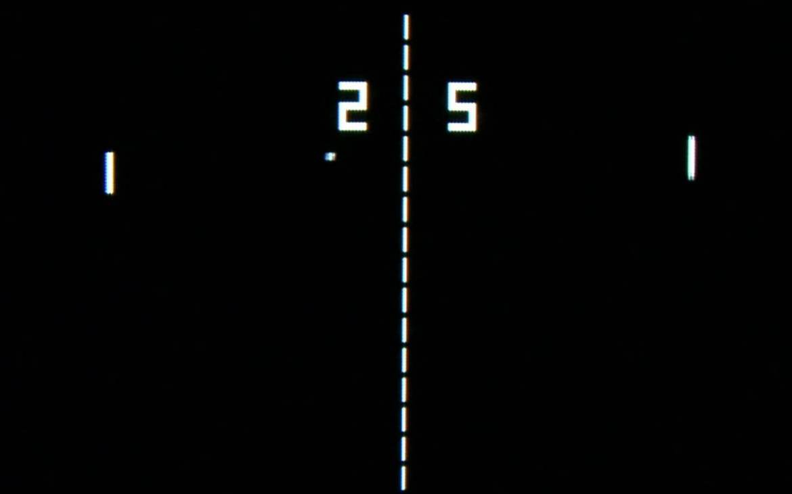

# Guida al Gioco Pong

## Introduzione
Pong è uno dei primi videogiochi arcade della storia, sviluppato da Atari nel 1972. Questo semplice gioco simula un tennis da tavolo virtuale dove due giocatori controllano le racchette (rappresentate da barre verticali) per colpire una palla avanti e indietro. La sua semplicità lo rende un progetto ideale per chi si avvicina allo sviluppo di videogiochi con JavaScript.



*Immagine: Schermata classica del gioco Pong con due racchette ai lati e la palla al centro.*

## Come si Gioca
- Due giocatori controllano ciascuno una racchetta sul lato sinistro e destro dello schermo
- L'obiettivo è colpire la palla con la propria racchetta
- Se un giocatore manca la palla, l'avversario guadagna un punto
- Vince chi raggiunge per primo il punteggio stabilito (solitamente 11 punti)

## Caratteristiche Principali
- Gameplay semplice e intuitivo
- Fisica di base con rimbalzi
- Incremento della velocità della palla dopo ogni colpo
- Sistema di punteggio

## Screenshot del Gioco


*Immagine: Pong durante una partita con i punteggi visualizzati nella parte superiore dello schermo.*

## Gioca Online
Puoi provare Pong online attraverso questi link:
- [Pong Classic](https://www.ponggame.org/)
- [Atari Pong](https://games.aarp.org/games/atari-pong)

## Creare Pong con JavaScript

### Elementi Base del Gioco
Per creare un gioco Pong funzionante, è necessario implementare i seguenti elementi:

1. **Canvas**: L'area di gioco dove disegnare racchette e palla
2. **Racchette**: Due rettangoli verticali controllati dai giocatori
3. **Palla**: Un oggetto circolare che rimbalza tra le racchette
4. **Collisioni**: Sistema per rilevare quando la palla colpisce una racchetta o i bordi
5. **Punteggio**: Sistema per tenere traccia dei punti di ciascun giocatore

### Configurazione HTML Base

```html
<!DOCTYPE html>
<html>
<head>
    <title>Pong JavaScript</title>
    <style>
        body {
            margin: 0;
            background-color: #000;
            display: flex;
            justify-content: center;
            align-items: center;
            height: 100vh;
        }
        canvas {
            border: 2px solid white;
        }
    </style>
</head>
<body>
    <canvas id="pongCanvas" width="800" height="600"></canvas>
    <script src="pong.js"></script>
</body>
</html>
```

### Implementazione JavaScript Base

```javascript
// Ottieni il riferimento al canvas
const canvas = document.getElementById('pongCanvas');
const ctx = canvas.getContext('2d');

// Costanti del gioco
const PADDLE_HEIGHT = 100;
const PADDLE_WIDTH = 10;
const BALL_RADIUS = 8;
const PADDLE_SPEED = 8;

// Oggetti del gioco
const ball = {
    x: canvas.width / 2,
    y: canvas.height / 2,
    dx: 5,
    dy: 5,
    radius: BALL_RADIUS
};

const leftPaddle = {
    x: 10,
    y: canvas.height / 2 - PADDLE_HEIGHT / 2,
    width: PADDLE_WIDTH,
    height: PADDLE_HEIGHT,
    speed: PADDLE_SPEED,
    up: false,
    down: false
};

const rightPaddle = {
    x: canvas.width - PADDLE_WIDTH - 10,
    y: canvas.height / 2 - PADDLE_HEIGHT / 2,
    width: PADDLE_WIDTH,
    height: PADDLE_HEIGHT,
    speed: PADDLE_SPEED,
    up: false,
    down: false
};

// Punteggi
let leftScore = 0;
let rightScore = 0;

// Gestione input
document.addEventListener('keydown', function(e) {
    // Controlli per il giocatore sinistro (W, S)
    if (e.key === 'w') leftPaddle.up = true;
    if (e.key === 's') leftPaddle.down = true;
    
    // Controlli per il giocatore destro (Freccia Su, Freccia Giù)
    if (e.key === 'ArrowUp') rightPaddle.up = true;
    if (e.key === 'ArrowDown') rightPaddle.down = true;
});

document.addEventListener('keyup', function(e) {
    if (e.key === 'w') leftPaddle.up = false;
    if (e.key === 's') leftPaddle.down = false;
    if (e.key === 'ArrowUp') rightPaddle.up = false;
    if (e.key === 'ArrowDown') rightPaddle.down = false;
});

// Funzione per aggiornare le posizioni
function update() {
    // Muovi la racchetta sinistra
    if (leftPaddle.up && leftPaddle.y > 0) {
        leftPaddle.y -= leftPaddle.speed;
    }
    if (leftPaddle.down && leftPaddle.y + leftPaddle.height < canvas.height) {
        leftPaddle.y += leftPaddle.speed;
    }
    
    // Muovi la racchetta destra
    if (rightPaddle.up && rightPaddle.y > 0) {
        rightPaddle.y -= rightPaddle.speed;
    }
    if (rightPaddle.down && rightPaddle.y + rightPaddle.height < canvas.height) {
        rightPaddle.y += rightPaddle.speed;
    }
    
    // Muovi la palla
    ball.x += ball.dx;
    ball.y += ball.dy;
    
    // Collisione con i bordi superiore e inferiore
    if (ball.y + ball.radius > canvas.height || ball.y - ball.radius < 0) {
        ball.dy = -ball.dy;
    }
    
    // Collisione con la racchetta sinistra
    if (
        ball.x - ball.radius < leftPaddle.x + leftPaddle.width &&
        ball.y > leftPaddle.y &&
        ball.y < leftPaddle.y + leftPaddle.height
    ) {
        ball.dx = -ball.dx;
        // Aumenta leggermente la velocità
        ball.dx *= 1.05;
    }
    
    // Collisione con la racchetta destra
    if (
        ball.x + ball.radius > rightPaddle.x &&
        ball.y > rightPaddle.y &&
        ball.y < rightPaddle.y + rightPaddle.height
    ) {
        ball.dx = -ball.dx;
        // Aumenta leggermente la velocità
        ball.dx *= 1.05;
    }
    
    // Punteggio
    if (ball.x + ball.radius > canvas.width) {
        leftScore++;
        resetBall();
    } else if (ball.x - ball.radius < 0) {
        rightScore++;
        resetBall();
    }
}

// Resetta la palla al centro
function resetBall() {
    ball.x = canvas.width / 2;
    ball.y = canvas.height / 2;
    ball.dx = (Math.random() > 0.5 ? 1 : -1) * 5;
    ball.dy = (Math.random() > 0.5 ? 1 : -1) * 5;
}

// Funzione di disegno
function draw() {
    // Pulisci il canvas
    ctx.fillStyle = 'black';
    ctx.fillRect(0, 0, canvas.width, canvas.height);
    
    // Disegna la linea centrale tratteggiata
    ctx.beginPath();
    ctx.setLineDash([5, 15]);
    ctx.moveTo(canvas.width / 2, 0);
    ctx.lineTo(canvas.width / 2, canvas.height);
    ctx.strokeStyle = 'white';
    ctx.stroke();
    ctx.setLineDash([]);
    
    // Disegna le racchette
    ctx.fillStyle = 'white';
    ctx.fillRect(leftPaddle.x, leftPaddle.y, leftPaddle.width, leftPaddle.height);
    ctx.fillRect(rightPaddle.x, rightPaddle.y, rightPaddle.width, rightPaddle.height);
    
    // Disegna la palla
    ctx.beginPath();
    ctx.arc(ball.x, ball.y, ball.radius, 0, Math.PI * 2);
    ctx.fillStyle = 'white';
    ctx.fill();
    ctx.closePath();
    
    // Disegna il punteggio
    ctx.font = '48px Arial';
    ctx.fillText(leftScore, canvas.width / 4, 50);
    ctx.fillText(rightScore, 3 * canvas.width / 4, 50);
}

// Game loop
function gameLoop() {
    update();
    draw();
    requestAnimationFrame(gameLoop);
}

// Avvia il gioco
gameLoop();
```

## Miglioramenti Possibili
Una volta implementato il gioco base, potresti considerare questi miglioramenti:

1. **Modalità Giocatore Singolo**: Aggiungi una AI per la racchetta destra
2. **Menu Iniziale**: Crea una schermata di avvio
3. **Effetti Sonori**: Aggiungi suoni per i rimbalzi e i punti
4. **Livelli di Difficoltà**: Varia la velocità della palla
5. **Personalizzazione**: Permetti ai giocatori di cambiare colori o dimensioni

## Risorse Utili
- [MDN Canvas API](https://developer.mozilla.org/it/docs/Web/API/Canvas_API)
- [HTML5 Game Development](https://www.w3schools.com/graphics/game_intro.asp)
- [Gamedev.js](https://gamedevjs.com/) - Community per sviluppatori di giochi JavaScript

---

**Nota**: Ricorda di creare la cartella `images` e aggiungere le immagini appropriate per rendere la guida completa.
