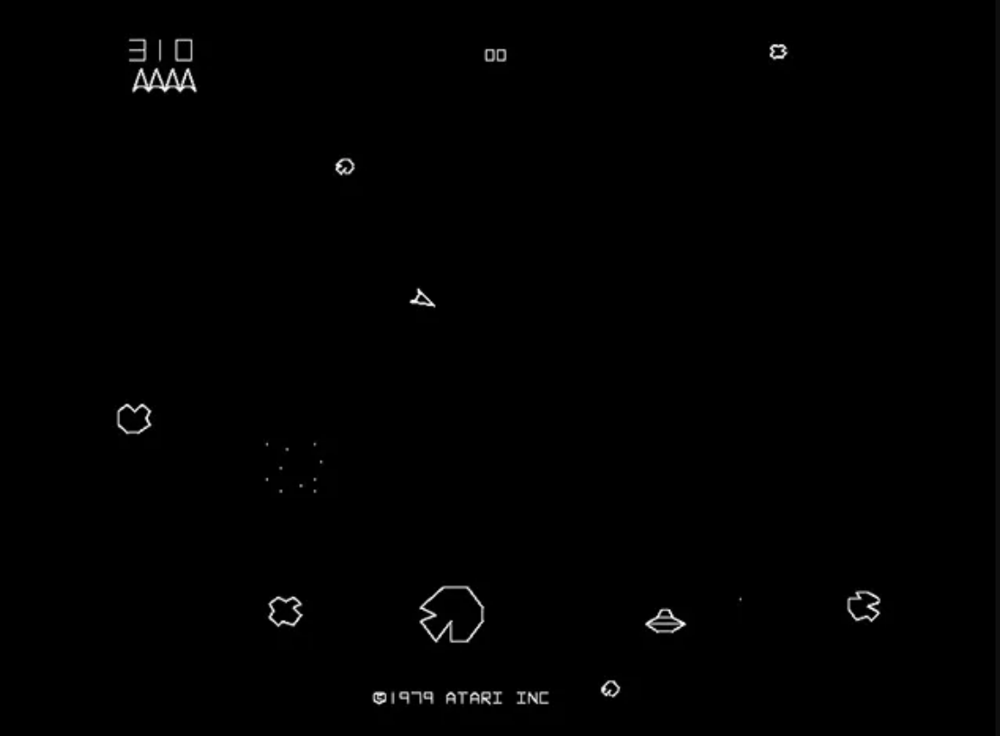

# Guida al Gioco Asteroids

## Introduzione
Asteroids è un classico gioco arcade sviluppato da Atari nel 1979. Il giocatore controlla una navicella spaziale in un campo di asteroidi e deve sopravvivere distruggendo gli asteroidi e evitando le collisioni. La sua meccanica di gioco innovativa e il suo design minimalista lo hanno reso uno dei giochi arcade più influenti di tutti i tempi.



*Immagine: Schermata classica del gioco Asteroids con la navicella al centro e gli asteroidi intorno.*

## Come si Gioca
- Il giocatore controlla una navicella triangolare al centro dello schermo
- La navicella può ruotare a 360 gradi e accelerare in avanti
- Il giocatore può sparare proiettili per distruggere gli asteroidi
- Gli asteroidi grandi si rompono in pezzi più piccoli quando colpiti
- A intervalli casuali appare un UFO che spara contro la navicella
- L'obiettivo è sopravvivere il più a lungo possibile e ottenere il punteggio più alto

## Caratteristiche Principali
- Fisica vettoriale con inerzia e momento
- Grafica minimalista a linee bianche su sfondo nero
- Sistema di punteggio basato sulle dimensioni degli asteroidi distrutti
- Teletrasporto ai bordi dello schermo (quando si esce da un lato, si rientra dall'altro)
- Pericoli crescenti con progressione di livelli

## Screenshot del Gioco


*Immagine: Asteroids durante il gameplay con la navicella che spara contro gli asteroidi.*

## Gioca Online
Puoi provare Asteroids online attraverso questi link:
- [Atari Asteroids](https://games.aarp.org/games/atari-asteroids)
- [Aseroids](https://www.retrogames.cc/arcade-games/asteroids-rev-4.html)

## Creare Asteroids con JavaScript

### Elementi Base del Gioco
Per creare un gioco Asteroids funzionante, è necessario implementare i seguenti elementi:

1. **Canvas**: L'area di gioco dove disegnare tutti gli elementi
2. **Navicella**: Un triangolo che può ruotare, accelerare e sparare
3. **Asteroidi**: Oggetti poligonali che si muovono e si dividono quando colpiti
4. **Proiettili**: Piccoli punti che vengono sparati dalla navicella
5. **Collisioni**: Sistema per rilevare quando i proiettili colpiscono gli asteroidi o quando la navicella collide con un asteroide
6. **Punteggio**: Sistema per tenere traccia dei punti guadagnati

### Implementazione della Navicella

La navicella è l'elemento più importante del gioco. Ecco come implementare le sue proprietà e il movimento:

```javascript
class Ship {
    constructor(canvas) {
        // Posizione iniziale al centro del canvas
        this.x = canvas.width / 2;
        this.y = canvas.height / 2;
        
        // Velocità e rotazione
        this.angle = -Math.PI / 2; // Orientata verso l'alto
        this.rotation = 0;
        this.thrusting = false;
        this.thrust = {
            x: 0,
            y: 0
        };
        
        // Proprietà fisiche
        this.radius = 15; // Per il rilevamento delle collisioni
        this.inertia = 0.99; // Rallentamento graduale
        this.rotationSpeed = 0.1;
        this.thrustSpeed = 0.1;
        
        // Visualizzazione
        this.vertices = [
            { x: 0, y: -this.radius },
            { x: this.radius * 0.7, y: this.radius * 0.7 },
            { x: 0, y: this.radius * 0.5 },
            { x: -this.radius * 0.7, y: this.radius * 0.7 }
        ];
        
        // Stato
        this.exploding = false;
        this.lives = 3;
    }
    
    // Ruota la navicella
    rotate(direction) {
        this.rotation = direction * this.rotationSpeed;
    }
    
    // Attiva la propulsione
    accelerate(on) {
        this.thrusting = on;
    }
    
    // Aggiorna posizione e stato
    update(canvas) {
        // Aggiorna l'angolo in base alla rotazione
        this.angle += this.rotation;
        
        // Applica la propulsione se attiva
        if (this.thrusting) {
            this.thrust.x += this.thrustSpeed * Math.cos(this.angle);
            this.thrust.y += this.thrustSpeed * Math.sin(this.angle);
        } else {
            // Applica attrito quando non si accelera
            this.thrust.x *= this.inertia;
            this.thrust.y *= this.inertia;
        }
        
        // Aggiorna la posizione
        this.x += this.thrust.x;
        this.y += this.thrust.y;
        
        // Gestisci il movimento ai bordi dello schermo
        if (this.x < 0) this.x = canvas.width;
        if (this.x > canvas.width) this.x = 0;
        if (this.y < 0) this.y = canvas.height;
        if (this.y > canvas.height) this.y = 0;
    }
    
    // Disegna la navicella
    draw(ctx) {
        if (this.exploding) {
            // Animazione di esplosione
            // ...
            return;
        }
        
        ctx.strokeStyle = 'white';
        ctx.lineWidth = 2;
        
        // Inizia il percorso di disegno
        ctx.beginPath();
        
        // Calcola e disegna i vertici ruotati della navicella
        this.vertices.forEach((vertex, i) => {
            const x = this.x + vertex.x * Math.cos(this.angle) - vertex.y * Math.sin(this.angle);
            const y = this.y + vertex.x * Math.sin(this.angle) + vertex.y * Math.cos(this.angle);
            
            if (i === 0) {
                ctx.moveTo(x, y);
            } else {
                ctx.lineTo(x, y);
            }
        });
        
        ctx.closePath();
        ctx.stroke();
        
        // Se la propulsione è attiva, disegna la fiamma
        if (this.thrusting) {
            ctx.beginPath();
            // Calcola i punti della fiamma
            const flameX = this.x - this.radius * Math.cos(this.angle);
            const flameY = this.y - this.radius * Math.sin(this.angle);
            
            ctx.moveTo(
                this.x - this.radius * 0.7 * Math.cos(this.angle) + 0.5 * this.radius * Math.sin(this.angle),
                this.y - this.radius * 0.7 * Math.sin(this.angle) - 0.5 * this.radius * Math.cos(this.angle)
            );
            
            ctx.lineTo(
                flameX - Math.random() * 2 * this.radius * Math.cos(this.angle),
                flameY - Math.random() * 2 * this.radius * Math.sin(this.angle)
            );
            
            ctx.lineTo(
                this.x - this.radius * 0.7 * Math.cos(this.angle) - 0.5 * this.radius * Math.sin(this.angle),
                this.y - this.radius * 0.7 * Math.sin(this.angle) + 0.5 * this.radius * Math.cos(this.angle)
            );
            
            ctx.closePath();
            ctx.stroke();
        }
    }
    
    // Spara un proiettile
    shoot(bullets) {
        bullets.push({
            x: this.x + 4/3 * this.radius * Math.cos(this.angle),
            y: this.y + 4/3 * this.radius * Math.sin(this.angle),
            xv: 7 * Math.cos(this.angle) + this.thrust.x,
            yv: 7 * Math.sin(this.angle) + this.thrust.y,
            r: 3,
            a: this.angle,
            lifetime: 60 // Durata in frame
        });
    }
}
```

### Implementazione degli Asteroidi

Gli asteroidi sono oggetti poligonali casuali che si muovono in varie direzioni:

```javascript
class Asteroid {
    constructor(x, y, radius, level, speed = 1) {
        this.x = x;
        this.y = y;
        this.radius = radius;
        this.level = level;
        this.speed = speed;
        
        // Direzione casuale
        this.angle = Math.random() * Math.PI * 2;
        this.xv = this.speed * Math.cos(this.angle);
        this.yv = this.speed * Math.sin(this.angle);
        
        // Generazione forma casuale per l'asteroide
        this.vertices = [];
        const vertCount = Math.floor(Math.random() * 4) + 7; // 7-10 vertici
        
        for (let i = 0; i < vertCount; i++) {
            const angle = i * Math.PI * 2 / vertCount;
            const length = this.radius * (0.8 + Math.random() * 0.4); // Raggio variabile
            
            this.vertices.push({
                x: length * Math.cos(angle),
                y: length * Math.sin(angle)
            });
        }
        
        // Rotazione
        this.rotation = Math.random() * 0.03 - 0.015; // Velocità di rotazione casuale
        this.angleRot = Math.random() * Math.PI * 2; // Angolo iniziale
    }
    
    update(canvas) {
        // Aggiorna la posizione
        this.x += this.xv;
        this.y += this.yv;
        
        // Aggiorna la rotazione
        this.angleRot += this.rotation;
        
        // Gestisci il movimento ai bordi dello schermo
        if (this.x < 0 - this.radius) this.x = canvas.width + this.radius;
        if (this.x > canvas.width + this.radius) this.x = 0 - this.radius;
        if (this.y < 0 - this.radius) this.y = canvas.height + this.radius;
        if (this.y > canvas.height + this.radius) this.y = 0 - this.radius;
    }
    
    draw(ctx) {
        ctx.strokeStyle = 'white';
        ctx.lineWidth = 2;
        ctx.beginPath();
        
        // Disegna i vertici ruotati
        this.vertices.forEach((vertex, i) => {
            const x = this.x + vertex.x * Math.cos(this.angleRot) - vertex.y * Math.sin(this.angleRot);
            const y = this.y + vertex.x * Math.sin(this.angleRot) + vertex.y * Math.cos(this.angleRot);
            
            if (i === 0) {
                ctx.moveTo(x, y);
            } else {
                ctx.lineTo(x, y);
            }
        });
        
        ctx.closePath();
        ctx.stroke();
    }
    
    // Divide l'asteroide in pezzi più piccoli quando colpito
    breakup() {
        // Se l'asteroide è abbastanza grande, dividerlo in pezzi più piccoli
        if (this.level < 3) {
            // Calcola nuovo raggio
            const newRadius = this.radius / 2;
            
            // Crea due nuovi asteroidi
            return [
                new Asteroid(this.x, this.y, newRadius, this.level + 1, this.speed + 0.5),
                new Asteroid(this.x, this.y, newRadius, this.level + 1, this.speed + 0.5)
            ];
        }
        
        // Se è già il più piccolo, non generare altri asteroidi
        return [];
    }
}
```

### Gestione delle Collisioni

La funzione di rilevamento delle collisioni è fondamentale per il gioco:

```javascript
function checkCollision(obj1, obj2) {
    // Calcola la distanza tra i due oggetti
    const dx = obj1.x - obj2.x;
    const dy = obj1.y - obj2.y;
    const distance = Math.sqrt(dx * dx + dy * dy);
    
    // Se la distanza è minore della somma dei raggi, c'è una collisione
    return distance < obj1.radius + obj2.radius;
}
```

## Implementazione del Game Loop Principale

Il cuore del gioco è il game loop che aggiorna e renderizza tutti gli elementi:

```javascript
function gameLoop() {
    // Pulisci il canvas
    ctx.fillStyle = 'black';
    ctx.fillRect(0, 0, canvas.width, canvas.height);
    
    // Aggiorna e disegna la navicella
    if (!ship.exploding) {
        ship.update(canvas);
        
        // Controlla collisioni con gli asteroidi
        asteroids.forEach(asteroid => {
            if (checkCollision(ship, asteroid)) {
                // Gestisci collisione navicella
                ship.exploding = true;
                ship.lives--;
                setTimeout(() => {
                    // Riposiziona la navicella dopo l'esplosione
                    resetShip();
                }, 2000);
            }
        });
    }
    
    ship.draw(ctx);
    
    // Aggiorna e disegna i proiettili
    for (let i = bullets.length - 1; i >= 0; i--) {
        // Aggiorna posizione
        bullets[i].x += bullets[i].xv;
        bullets[i].y += bullets[i].yv;
        
        // Gestisci bordi dello schermo
        if (bullets[i].x < 0) bullets[i].x = canvas.width;
        if (bullets[i].x > canvas.width) bullets[i].x = 0;
        if (bullets[i].y < 0) bullets[i].y = canvas.height;
        if (bullets[i].y > canvas.height) bullets[i].y = 0;
        
        // Disegna il proiettile
        ctx.fillStyle = 'white';
        ctx.beginPath();
        ctx.arc(bullets[i].x, bullets[i].y, bullets[i].r, 0, Math.PI * 2);
        ctx.fill();
        
        // Riduzione durata del proiettile
        bullets[i].lifetime--;
        if (bullets[i].lifetime <= 0) {
            bullets.splice(i, 1);
            continue;
        }
        
        // Controlla collisioni con gli asteroidi
        for (let j = asteroids.length - 1; j >= 0; j--) {
            if (checkCollision(bullets[i], asteroids[j])) {
                // Crea nuovi asteroidi più piccoli
                const newAsteroids = asteroids[j].breakup();
                asteroids.splice(j, 1);
                asteroids.push(...newAsteroids);
                
                // Incrementa punteggio in base alla dimensione dell'asteroide
                score += (4 - newAsteroids.length) * 100;
                
                // Rimuovi il proiettile
                bullets.splice(i, 1);
                break;
            }
        }
    }
    
    // Aggiorna e disegna gli asteroidi
    asteroids.forEach(asteroid => {
        asteroid.update(canvas);
        asteroid.draw(ctx);
    });
    
    // Disegna punteggio e vite
    ctx.textAlign = "right";
    ctx.textBaseline = "middle";
    ctx.fillStyle = "white";
    ctx.font = "20px Arial";
    ctx.fillText("SCORE: " + score, canvas.width - 20, 25);
    
    // Disegna vite rimanenti
    for (let i = 0; i < ship.lives; i++) {
        drawShip(canvas.width - 50 - i * 30, 50, -Math.PI / 2, 15, ctx);
    }
    
    // Controlla fine livello
    if (asteroids.length === 0) {
        // Avanza al livello successivo
        level++;
        createNewLevel();
    }
    
    // Continua il loop
    requestAnimationFrame(gameLoop);
}
```

## Miglioramenti Possibili
Una volta implementato il gioco base, potresti considerare questi miglioramenti:

1. **UFO Nemico**: Aggiungi una navicella nemica che appare casualmente e spara contro il giocatore
2. **Effetti Sonori**: Aggiungi suoni per esplosioni, spari e propulsione
3. **Effetti Visivi**: Aggiungi animazioni di esplosione più elaborate
4. **Power-Up**: Crea potenziamenti che cadono dagli asteroidi distrutti
5. **Multigiocatore**: Implementa una modalità per due giocatori

## Risorse Utili
- [MDN Canvas API](https://developer.mozilla.org/it/docs/Web/API/Canvas_API)
- [Trigonometria per Sviluppatori di Giochi](https://noobtuts.com/javascript/trigonometry-for-games)
- [GitHub Repositories di Giochi Arcade](https://github.com/topics/arcade-game)
- [Vettori e Fisica per Giochi](https://www.toptal.com/game/video-game-physics-part-i-an-introduction-to-rigid-body-dynamics)

---

**Nota**: Ricorda di creare la cartella `images` e aggiungere le immagini appropriate per rendere la guida completa.
