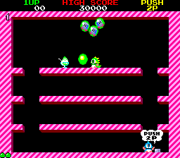

# Guida al Gioco Bubble Bobble

## Introduzione
Bubble Bobble è un classico gioco arcade sviluppato da Taito nel 1986. I giocatori controllano dei draghetti (Bub e Bob) che possono sparare bolle per intrappolare i nemici. Una volta che un nemico è intrappolato in una bolla, il giocatore può farla scoppiare saltandoci sopra, trasformando il nemico in un frutto o un oggetto bonus che può essere raccolto per ottenere punti.



*Immagine: Schermata classica del gioco Bubble Bobble con i draghetti e i nemici intrappolati nelle bolle.*

## Come si Gioca
- Controlla il tuo draghetto attraverso piattaforme a più livelli
- Spara bolle per intrappolare i nemici
- Fai scoppiare le bolle saltandoci sopra per eliminare i nemici
- Raccogli frutta e oggetti bonus per ottenere punti
- Completa tutti i livelli per vincere il gioco

## Caratteristiche Principali
- Gameplay semplice ma strategico
- Grafica colorata e accattivante
- Sistema di punteggio basato sulla raccolta di bonus
- Possibilità di giocare in modalità cooperativa con due giocatori
- Livelli progressivamente più difficili

## Implementazione in JavaScript

La versione HTML/JavaScript di Bubble Bobble ricrea l'esperienza classica del gioco arcade. Ecco una spiegazione delle principali componenti del codice:

### Configurazione del Canvas

Il gioco utilizza l'elemento HTML Canvas per disegnare tutti gli elementi grafici:

```javascript
const canvas = document.getElementById('gameCanvas');
const ctx = canvas.getContext('2d');
```

### Classi di Gioco

Il gioco è strutturato utilizzando classi per rappresentare i vari elementi:

1. **Classe Player**: Gestisce il draghetto controllato dal giocatore.

```javascript
class Player {
    constructor() {
        this.width = sprites.player.width;
        this.height = sprites.player.height;
        this.x = canvas.width / 2 - this.width / 2;
        this.y = canvas.height - 100 - this.height;
        this.vx = 0;
        this.vy = 0;
        this.jumping = false;
        this.canJump = true;
        this.facingRight = true;
        this.bubbleCooldown = 0;
    }
    
    // Altri metodi per movimento, salto e sparo di bolle
}
```

2. **Classe Bubble**: Rappresenta le bolle che il giocatore può sparare.

```javascript
class Bubble {
    constructor(x, y, direction) {
        this.x = x;
        this.y = y;
        this.width = sprites.bubble.width;
        this.height = sprites.bubble.height;
        this.vx = direction * BUBBLE_SPEED;
        this.vy = 0;
        this.life = BUBBLE_LIFETIME;
        this.hasEnemy = false;
        this.enemyType = null;
        this.floating = false;
    }
    
    // Altri metodi per movimento e collisioni
}
```

3. **Classe Enemy**: Gestisce i nemici che il giocatore deve catturare.

```javascript
class Enemy {
    constructor(x, y, type) {
        this.x = x;
        this.y = y;
        this.width = sprites.enemy.width;
        this.height = sprites.enemy.height;
        this.vx = Math.random() < 0.5 ? -1 : 1;
        this.vy = 0;
        this.type = type || Math.floor(Math.random() * sprites.enemy.colors.length);
        this.trapped = false;
    }
    
    // Altri metodi per movimento e comportamento
}
```

### Fisica e Collisioni

Il gioco implementa un sistema di fisica semplice ma efficace per gestire gravità, salti e collisioni:

```javascript
// Applicazione della gravità
this.vy += GRAVITY;

// Collisione con le piattaforme
for (let platform of platforms) {
    if (this.x + this.width > platform.x && 
        this.x < platform.x + platform.width && 
        this.y + this.height >= platform.y && 
        this.y + this.height <= platform.y + 10 && 
        this.vy >= 0) {
        
        this.y = platform.y - this.height;
        this.vy = 0;
        this.jumping = false;
        this.canJump = true;
    }
}
```

### Gestione degli Input

Il gioco rileva gli input da tastiera per controllare il draghetto:

```javascript
window.addEventListener('keydown', function(e) {
    keys[e.key] = true;
});

window.addEventListener('keyup', function(e) {
    keys[e.key] = false;
});

// Nel loop di aggiornamento
if (keys['ArrowLeft']) {
    player.vx = -5;
    player.facingRight = false;
} else if (keys['ArrowRight']) {
    player.vx = 5;
    player.facingRight = true;
} else {
    player.vx = 0;
}

if (keys['ArrowUp'] && player.canJump) {
    player.vy = JUMP_FORCE;
    player.jumping = true;
    player.canJump = false;
}

if (keys[' '] && player.bubbleCooldown <= 0) {
    shootBubble();
    player.bubbleCooldown = 15; // Cooldown tra gli spari
}
```

### Loop di Gioco

Il loop principale del gioco aggiorna tutti gli elementi e gestisce le interazioni:

```javascript
function update() {
    if (!gameRunning) return;
    
    // Aggiorna il giocatore
    player.update();
    
    // Aggiorna le bolle
    for (let i = bubbles.length - 1; i >= 0; i--) {
        bubbles[i].update();
        
        // Rimuovi le bolle scadute
        if (bubbles[i].life <= 0) {
            bubbles.splice(i, 1);
            continue;
        }
        
        // Controlla collisioni con i nemici
        if (!bubbles[i].hasEnemy) {
            for (let j = enemies.length - 1; j >= 0; j--) {
                if (!enemies[j].trapped && checkCollision(bubbles[i], enemies[j])) {
                    bubbles[i].hasEnemy = true;
                    bubbles[i].enemyType = enemies[j].type;
                    enemies[j].trapped = true;
                    enemies.splice(j, 1);
                    break;
                }
            }
        }
    }
    
    // Aggiorna i nemici
    for (let i = enemies.length - 1; i >= 0; i--) {
        enemies[i].update();
    }
    
    // Controlla collisioni tra giocatore e bolle con nemici
    for (let i = bubbles.length - 1; i >= 0; i--) {
        if (bubbles[i].hasEnemy && checkCollision(player, bubbles[i])) {
            // Crea un frutto quando la bolla scoppia
            createFruit(bubbles[i].x, bubbles[i].y, bubbles[i].enemyType);
            bubbles.splice(i, 1);
            score += 100;
        }
    }
    
    // Controlla collisioni tra giocatore e frutti
    for (let i = fruits.length - 1; i >= 0; i--) {
        if (checkCollision(player, fruits[i])) {
            score += 200;
            fruits.splice(i, 1);
        }
    }
    
    // Controlla collisioni tra giocatore e nemici
    for (let i = enemies.length - 1; i >= 0; i--) {
        if (!enemies[i].trapped && checkCollision(player, enemies[i])) {
            loseLife();
            break;
        }
    }
    
    // Controlla se tutti i nemici sono stati eliminati
    if (enemies.length === 0 && bubbles.filter(b => b.hasEnemy).length === 0) {
        levelComplete();
    }
    
    // Disegna tutto
    draw();
    
    // Richiedi il prossimo frame
    requestAnimationFrame(update);
}
```

### Sistema di Livelli

Il gioco implementa un sistema di livelli progressivi con difficoltà crescente:

```javascript
function startLevel() {
    // Pulisci gli array
    bubbles = [];
    enemies = [];
    fruits = [];
    
    // Crea piattaforme per il livello
    createPlatforms();
    
    // Crea nemici in base al livello
    for (let i = 0; i < ENEMY_COUNT_PER_LEVEL + Math.floor(level / 2); i++) {
        const x = Math.random() * (canvas.width - sprites.enemy.width);
        const y = Math.random() * (canvas.height / 2);
        enemies.push(new Enemy(x, y));
    }
    
    // Resetta il giocatore
    player.x = canvas.width / 2 - player.width / 2;
    player.y = canvas.height - 100 - player.height;
    player.vx = 0;
    player.vy = 0;
    
    // Avvia il loop di gioco
    gameRunning = true;
    requestAnimationFrame(update);
}
```

## Conclusione

Bubble Bobble è un classico arcade che combina azione, strategia e precisione. La sua implementazione in JavaScript dimostra come sia possibile ricreare l'esperienza di gioco originale utilizzando tecnologie web moderne. Il gioco utilizza concetti fondamentali di programmazione di giochi come la gestione degli stati, la fisica delle collisioni, l'intelligenza artificiale dei nemici e la progressione dei livelli.