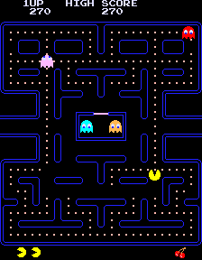

# Guida al Gioco Pac-Man

## Introduzione
Pac-Man è uno dei videogiochi arcade più iconici e riconoscibili di tutti i tempi, sviluppato da Namco e rilasciato nel 1980. Il giocatore controlla Pac-Man, un personaggio a forma di cerchio giallo con una bocca che si apre e si chiude, attraverso un labirinto pieno di puntini (chiamati "pac-dots") da mangiare mentre evita quattro fantasmi colorati che lo inseguono.



*Immagine: Schermata classica del gioco Pac-Man con il labirinto, i puntini e i fantasmi.*

## Come si Gioca
- Controlla Pac-Man attraverso un labirinto usando i tasti direzionali
- Mangia tutti i puntini nel labirinto per completare il livello
- Evita i quattro fantasmi (Blinky, Pinky, Inky e Clyde) che ti inseguono
- Mangia le power pellet (puntini più grandi) per rendere temporaneamente vulnerabili i fantasmi
- Durante questo periodo, puoi mangiare i fantasmi per ottenere punti bonus
- Completa tutti i livelli per ottenere il punteggio più alto possibile

## Collegamenti esterni
- [Pac-Man Wiki](https://www.masswerk.at/JavaPac/JS-PacMan2.html)

## Caratteristiche Principali
- Labirinto con percorsi strategici
- Quattro fantasmi con comportamenti di inseguimento diversi
- Sistema di power-up con le power pellet
- Progressione di livelli con difficoltà crescente
- Sistema di punteggio basato su puntini, fantasmi e bonus

## Implementazione in JavaScript

La versione HTML/JavaScript di Pac-Man ricrea l'esperienza classica del gioco arcade. Ecco una spiegazione delle principali componenti del codice:

### Configurazione del Canvas e Costanti di Gioco

Il gioco utilizza l'elemento HTML Canvas per disegnare tutti gli elementi grafici:

```javascript
const canvas = document.getElementById('game-canvas');
const ctx = canvas.getContext('2d');

// Game Constants
const CELL_SIZE = 20;
const ROWS = 31;
const COLS = 28;

// Set canvas size
canvas.width = COLS * CELL_SIZE;
canvas.height = ROWS * CELL_SIZE;
```

### Mappa del Labirinto

Il labirinto è rappresentato da una matrice bidimensionale dove ogni numero rappresenta un tipo diverso di cella:

```javascript
// Game map layout
// 0 = empty, 1 = wall, 2 = dot, 3 = power pellet, 4 = ghost door
const MAP_LAYOUT = [
    [1,1,1,1,1,1,1,1,1,1,1,1,1,1,1,1,1,1,1,1,1,1,1,1,1,1,1,1],
    [1,2,2,2,2,2,2,2,2,2,2,2,2,1,1,2,2,2,2,2,2,2,2,2,2,2,2,1],
    [1,2,1,1,1,1,2,1,1,1,1,1,2,1,1,2,1,1,1,1,1,2,1,1,1,1,2,1],
    // ... resto della mappa
];
```

### Personaggio Pac-Man

Pac-Man è rappresentato da un oggetto con proprietà per posizione, direzione e animazione:

```javascript
class Pacman {
    constructor(x, y) {
        this.x = x;
        this.y = y;
        this.radius = CELL_SIZE / 2 - 2;
        this.speed = 2;
        this.direction = { x: 0, y: 0 };
        this.nextDirection = { x: 0, y: 0 };
        this.angle = 0.2;
        this.mouthOpen = true;
        this.mouthAngle = 0.2;
        this.mouthSpeed = 0.02;
    }
    
    update() {
        // Aggiorna l'animazione della bocca
        if (this.mouthOpen) {
            this.mouthAngle += this.mouthSpeed;
            if (this.mouthAngle >= 0.2) {
                this.mouthAngle = 0.2;
                this.mouthOpen = false;
            }
        } else {
            this.mouthAngle -= this.mouthSpeed;
            if (this.mouthAngle <= 0) {
                this.mouthAngle = 0;
                this.mouthOpen = true;
            }
        }
        
        // Prova a cambiare direzione se richiesto
        this.tryChangeDirection();
        
        // Muovi Pac-Man nella direzione corrente
        this.x += this.direction.x * this.speed;
        this.y += this.direction.y * this.speed;
        
        // Gestisci il tunnel
        this.handleTunnel();
        
        // Mangia i puntini
        this.eatDots();
    }
    
    draw() {
        ctx.save();
        ctx.translate(this.x, this.y);
        
        // Ruota in base alla direzione
        let angle = 0;
        if (this.direction.x === 1) angle = 0;
        else if (this.direction.x === -1) angle = Math.PI;
        else if (this.direction.y === -1) angle = -Math.PI/2;
        else if (this.direction.y === 1) angle = Math.PI/2;
        ctx.rotate(angle);
        
        // Disegna Pac-Man
        ctx.beginPath();
        ctx.arc(0, 0, this.radius, this.mouthAngle, Math.PI * 2 - this.mouthAngle);
        ctx.lineTo(0, 0);
        ctx.fillStyle = COLORS.pacman;
        ctx.fill();
        ctx.closePath();
        
        ctx.restore();
    }
}
```

### Fantasmi

I fantasmi sono rappresentati da una classe con comportamenti di inseguimento diversi:

```javascript
class Ghost {
    constructor(x, y, type) {
        this.x = x;
        this.y = y;
        this.type = type; // blinky, pinky, inky, clyde
        this.radius = CELL_SIZE / 2 - 2;
        this.speed = 1.5;
        this.direction = { x: 0, y: -1 };
        this.nextDirection = { x: 0, y: -1 };
        this.mode = "scatter"; // scatter, chase, frightened
        this.frightened = false;
        this.frightenedTimer = 0;
        this.flashingTimer = 0;
        this.eaten = false;
        this.respawning = false;
        this.respawnTimer = 0;
        this.target = { x: 0, y: 0 };
    }
    
    update() {
        // Gestisci lo stato spaventato
        if (this.frightened) {
            this.frightenedTimer--;
            if (this.frightenedTimer <= 0) {
                this.frightened = false;
                this.speed = 1.5;
            } else if (this.frightenedTimer < 100) {
                // Lampeggia quando sta per finire
                this.flashingTimer++;
                if (this.flashingTimer > 10) {
                    this.flashingTimer = 0;
                }
            }
        }
        
        // Se mangiato, torna alla casa dei fantasmi
        if (this.eaten) {
            this.target = { x: ghostsHome.x, y: ghostsHome.y };
            if (Math.abs(this.x - ghostsHome.x) < 5 && Math.abs(this.y - ghostsHome.y) < 5) {
                this.eaten = false;
                this.respawning = true;
                this.respawnTimer = 100;
            }
        } else if (this.respawning) {
            this.respawnTimer--;
            if (this.respawnTimer <= 0) {
                this.respawning = false;
            }
            return; // Non muovere mentre respawna
        } else {
            // Calcola il target in base al tipo di fantasma e alla modalità
            this.calculateTarget();
        }
        
        // Scegli la prossima direzione
        this.chooseNextDirection();
        
        // Muovi il fantasma
        this.x += this.direction.x * this.speed;
        this.y += this.direction.y * this.speed;
        
        // Gestisci il tunnel
        this.handleTunnel();
    }
    
    calculateTarget() {
        if (this.mode === "scatter") {
            // In modalità scatter, ogni fantasma ha un angolo preferito
            switch(this.type) {
                case "blinky": // Rosso, angolo in alto a destra
                    this.target = { x: COLS * CELL_SIZE - CELL_SIZE, y: 0 };
                    break;
                case "pinky": // Rosa, angolo in alto a sinistra
                    this.target = { x: 0, y: 0 };
                    break;
                case "inky": // Ciano, angolo in basso a destra
                    this.target = { x: COLS * CELL_SIZE - CELL_SIZE, y: ROWS * CELL_SIZE - CELL_SIZE };
                    break;
                case "clyde": // Arancione, angolo in basso a sinistra
                    this.target = { x: 0, y: ROWS * CELL_SIZE - CELL_SIZE };
                    break;
            }
        } else if (this.mode === "chase") {
            // In modalità chase, ogni fantasma ha una strategia diversa
            switch(this.type) {
                case "blinky": // Rosso, insegue direttamente Pac-Man
                    this.target = { x: pacman.x, y: pacman.y };
                    break;
                case "pinky": // Rosa, mira 4 celle davanti a Pac-Man
                    this.target = {
                        x: pacman.x + pacman.direction.x * 4 * CELL_SIZE,
                        y: pacman.y + pacman.direction.y * 4 * CELL_SIZE
                    };
                    break;
                case "inky": // Ciano, strategia complessa basata su Blinky e Pac-Man
                    const blinky = ghosts.find(g => g.type === "blinky");
                    const pivotX = pacman.x + pacman.direction.x * 2 * CELL_SIZE;
                    const pivotY = pacman.y + pacman.direction.y * 2 * CELL_SIZE;
                    this.target = {
                        x: pivotX + (pivotX - blinky.x),
                        y: pivotY + (pivotY - blinky.y)
                    };
                    break;
                case "clyde": // Arancione, alterna tra inseguire e scappare
                    const distance = Math.sqrt(
                        Math.pow(this.x - pacman.x, 2) + 
                        Math.pow(this.y - pacman.y, 2)
                    );
                    if (distance < 8 * CELL_SIZE) {
                        // Se troppo vicino, vai nell'angolo in basso a sinistra
                        this.target = { x: 0, y: ROWS * CELL_SIZE - CELL_SIZE };
                    } else {
                        // Altrimenti insegui Pac-Man
                        this.target = { x: pacman.x, y: pacman.y };
                    }
                    break;
            }
        } else if (this.frightened) {
            // In modalità spaventato, muoviti casualmente
            this.target = {
                x: Math.floor(Math.random() * COLS) * CELL_SIZE,
                y: Math.floor(Math.random() * ROWS) * CELL_SIZE
            };
        }
    }
}
```

### Gestione delle Collisioni

Il gioco implementa un sistema di collisioni per rilevare quando Pac-Man mangia puntini o viene catturato dai fantasmi:

```javascript
function checkCollisions() {
    // Controlla collisioni con i fantasmi
    for (let ghost of ghosts) {
        if (ghost.respawning) continue;
        
        const distance = Math.sqrt(
            Math.pow(pacman.x - ghost.x, 2) + 
            Math.pow(pacman.y - ghost.y, 2)
        );
        
        if (distance < pacman.radius + ghost.radius) {
            if (ghost.frightened) {
                // Pac-Man mangia il fantasma
                ghost.eaten = true;
                ghost.frightened = false;
                score += 200 * Math.pow(2, ghostsEaten);
                ghostsEaten++;
            } else if (!ghost.eaten) {
                // Fantasma cattura Pac-Man
                loseLife();
                return;
            }
        }
    }
}

function eatDots() {
    // Converti la posizione di Pac-Man in coordinate della griglia
    const col = Math.floor(this.x / CELL_SIZE);
    const row = Math.floor(this.y / CELL_SIZE);
    
    // Controlla se c'è un puntino in questa posizione
    for (let i = 0; i < dots.length; i++) {
        if (dots[i].col === col && dots[i].row === row) {
            // Rimuovi il puntino e aggiungi punti
            dots.splice(i, 1);
            score += 10;
            dotCount--;
            break;
        }
    }
    
    // Controlla se c'è una power pellet in questa posizione
    for (let i = 0; i < powerPellets.length; i++) {
        if (powerPellets[i].col === col && powerPellets[i].row === row) {
            // Rimuovi la power pellet e attiva la modalità spaventato
            powerPellets.splice(i, 1);
            score += 50;
            activateFrightenedMode();
            break;
        }
    }
    
    // Controlla se tutti i puntini sono stati mangiati
    if (dotCount === 0) {
        levelComplete();
    }
}
```

### Loop di Gioco

Il loop principale del gioco aggiorna tutti gli elementi e gestisce le interazioni:

```javascript
function update() {
    if (!gameRunning) return;
    
    // Pulisci il canvas
    ctx.clearRect(0, 0, canvas.width, canvas.height);
    
    // Disegna il labirinto
    drawMaze();
    
    // Disegna i puntini e le power pellet
    drawDots();
    drawPowerPellets();
    
    // Aggiorna e disegna Pac-Man
    pacman.update();
    pacman.draw();
    
    // Aggiorna la modalità dei fantasmi
    updateGhostMode();
    
    // Aggiorna e disegna i fantasmi
    for (let ghost of ghosts) {
        ghost.update();
        ghost.draw();
    }
    
    // Controlla collisioni
    checkCollisions();
    
    // Aggiorna il punteggio
    scoreDisplay.textContent = `Score: ${score}`;
    
    // Continua il loop
    animationId = requestAnimationFrame(update);
}
```

## Conclusione

Pac-Man è un classico senza tempo che ha definito un'intera generazione di videogiochi. La sua implementazione in JavaScript dimostra concetti fondamentali di programmazione di giochi come la gestione delle collisioni, l'intelligenza artificiale dei nemici, la gestione degli stati e l'animazione. Nonostante la sua apparente semplicità, Pac-Man offre un gameplay profondo e strategico che continua a divertire i giocatori anche dopo decenni dalla sua creazione.