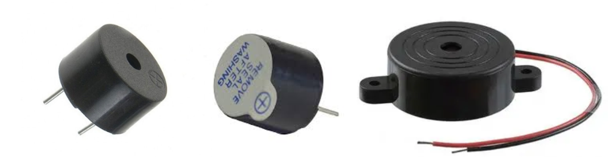

# Guida all'utilizzo del Buzzer con Arduino

## Parte 1: Le basi

### Cos'è un Buzzer?
Un buzzer è un componente elettronico che converte un segnale elettrico in un suono. Spesso viene utilizzato come segnalatore acustico nei sistemi con microcontrollori. Esistono principalmente due tipi di buzzer:
- **Buzzer passivo**: è un dispositivo che genera suono tramite una membrana piezoelettrica vibrante, richiedendo un segnale esterno per funzionare. Non ha un oscillatore interno, quindi necessita di un circuito esterno per produrre il segnale oscillante. È utilizzato in allarmi e notifiche per la sua semplicità e basso consumo energetico. La frequenza del suono dipende dal segnale applicato, offrendo flessibilità nel tono. È economico e permette un controllo personalizzato del suono, rendendolo ideale per progetti fai-da-te.
- **Buzzer attivo**: ha un oscillatore interno che permette di emettere un tono a frequenza fissa se viene alimentato con una tensione continua. L’oscillatore interno è in grado di modificare il campo magnetico di una bobina a cui è connesso meccanicamente una membrana che oscillerà alla frequenza fissata dall’oscillatore.



### Datasheet
Ecco alcuni link a datasheet di buzzer disponibili in commercio:
- [Mouser - EC211 SDR Datasheet](http://www.mouser.com/ds/2/400/ec211_sdr-28101.pdf) 
- [Same Sky Devices - CEM-1203-42 Datasheet](https://www.sameskydevices.com/product/resource/cem-1203-42-.pdf) 
- [Gavazzionline - PLBZ Datasheet](https://www.gavazzionline.com/pdf/Datasheet_PLBZ.pdf) 

### Componenti necessari
- Arduino (qualsiasi modello)
- Buzzer (attivo o passivo)
- Resistore da 100Ω (opzionale, per limitare la corrente)
- Breadboard
- Cavi di collegamento

### Schema di collegamento base
1. Collega il pin positivo del buzzer a un pin digitale di Arduino (es. pin 8)
2. Collega il pin negativo del buzzer a GND
3. Opzionalmente, inserisci un resistore da 100Ω in serie per limitare la corrente
Per il collegamento diretto del buzzer ad Arduino, verificare che la corrente assorbita sia inferiore a 20mA. E’ altamente raccomandato comandare il buzzer tramite un transistor.

### Primo sketch: Tono semplice

```cpp
// Sketch base per buzzer attivo
const int BUZZER_PIN = 8;  // Pin a cui è collegato il buzzer

void setup() {
  pinMode(BUZZER_PIN, OUTPUT);  // Imposta il pin del buzzer come output
}

void loop() {
  digitalWrite(BUZZER_PIN, HIGH);  // Attiva il buzzer
  delay(1000);                    // Mantieni attivo per 1 secondo
  digitalWrite(BUZZER_PIN, LOW);   // Disattiva il buzzer
  delay(1000);                    // Pausa di 1 secondo
}
```
[Vedi il codice completo](Buzzer_01_buzzer_attivo.ino)

### Utilizzo di un buzzer passivo
Se usi un buzzer passivo, puoi generare diverse frequenze utilizzando la funzione `tone()`:

```cpp
// Sketch base per buzzer passivo
const int BUZZER_PIN = 8;  // Pin a cui è collegato il buzzer

void setup() {
  pinMode(BUZZER_PIN, OUTPUT);  // Imposta il pin del buzzer come output
}

void loop() {
  tone(BUZZER_PIN, 1000);  // Genera un tono a 1000 Hz
  delay(1000);            // Mantieni il tono per 1 secondo
  noTone(BUZZER_PIN);      // Ferma il tono
  delay(1000);            // Pausa di 1 secondo
}
```
[Vedi il codice completo](Buzzer_02_buzzer_passivo.ino)
[Versione online](https://wokwi.com/projects/425933995361295361)

## Parte 2: Funzionalità intermedie

### Suonare una melodia semplice

```cpp
// Riproduzione di una melodia semplice
const int BUZZER_PIN = 8;

// Definizione delle note (frequenze in Hz)
#define NOTE_C4  262
#define NOTE_D4  294
#define NOTE_E4  330
#define NOTE_F4  349
#define NOTE_G4  392
#define NOTE_A4  440
#define NOTE_B4  494
#define NOTE_C5  523

// Melodia: Array di note
int melody[] = {NOTE_C4, NOTE_D4, NOTE_E4, NOTE_F4, NOTE_G4, NOTE_A4, NOTE_B4, NOTE_C5};

// Durata delle note (in ms)
int noteDurations[] = {250, 250, 250, 250, 250, 250, 250, 500};

void setup() {
  pinMode(BUZZER_PIN, OUTPUT);
}

void loop() {
  // Riproduci una volta la melodia
  for (int i = 0; i < 8; i++) {
    tone(BUZZER_PIN, melody[i]);
    delay(noteDurations[i]);
    noTone(BUZZER_PIN);
    delay(50);  // Breve pausa tra le note
  }
  
  delay(2000);  // Pausa prima di ripetere
}
```
[Vedi il codice completo](Buzzer_03_melodia_semplice.ino)
[Versione online](https://wokwi.com/projects/425933995361295361)

### Controllo del volume (PWM)
Per i buzzer passivi, puoi simulare diversi livelli di volume utilizzando il PWM (Pulse Width Modulation):

```cpp
// Controllo del volume tramite PWM
const int BUZZER_PIN = 9;  // Usa un pin che supporti PWM (es. 3, 5, 6, 9, 10, 11)

void setup() {
  pinMode(BUZZER_PIN, OUTPUT);
}

void loop() {
  // Volume crescente
  for (int volume = 0; volume <= 255; volume += 5) {
    analogWrite(BUZZER_PIN, volume);  // Imposta il "volume" tramite duty cycle
    delay(30);
  }
  
  // Volume decrescente
  for (int volume = 255; volume >= 0; volume -= 5) {
    analogWrite(BUZZER_PIN, volume);
    delay(30);
  }
  
  delay(1000);  // Pausa prima di ripetere
}
```
[Vedi il codice completo](Buzzer_04_controllo_volume_pwm.ino)

## Parte 3: Applicazioni avanzate

### Sistema di allarme con sensore di movimento (PIR)

```cpp
// Sistema di allarme con sensore PIR
const int BUZZER_PIN = 8;
const int PIR_PIN = 2;     // Pin del sensore PIR
const int LED_PIN = 13;    // LED integrato

// Parametri allarme
const int ALARM_DURATION = 3000;  // Durata dell'allarme in ms
boolean alarmActive = false;     // Stato dell'allarme

void setup() {
  pinMode(BUZZER_PIN, OUTPUT);
  pinMode(PIR_PIN, INPUT);
  pinMode(LED_PIN, OUTPUT);
  Serial.begin(9600);
  Serial.println("Sistema di allarme attivo");
}

void loop() {
  int motionDetected = digitalRead(PIR_PIN);
  
  if (motionDetected == HIGH) {
    Serial.println("Movimento rilevato!");
    triggerAlarm();
  }
}

void triggerAlarm() {
  // Attiva l'allarme
  alarmActive = true;
  unsigned long startTime = millis();
  
  // Suona per la durata impostata
  while (millis() - startTime < ALARM_DURATION) {
    // Suono di allarme modulato
    for (int freq = 800; freq < 2000; freq += 10) {
      tone(BUZZER_PIN, freq);
      digitalWrite(LED_PIN, HIGH);
      delay(5);
    }
    for (int freq = 2000; freq > 800; freq -= 10) {
      tone(BUZZER_PIN, freq);
      digitalWrite(LED_PIN, LOW);
      delay(5);
    }
  }
  
  // Disattiva l'allarme
  noTone(BUZZER_PIN);
  digitalWrite(LED_PIN, LOW);
  alarmActive = false;
}

```
[Vedi il codice completo](Buzzer_05_sistema_allarme_pir.ino)
[Versione online](https://wokwi.com/projects/425932743963164673)

### Comunicazione in codice Morse

```cpp
// Comunicazione in codice Morse
const int BUZZER_PIN = 8;

// Parametri temporali del codice Morse (in ms)
const int dotDuration = 200;
const int dashDuration = dotDuration * 3;
const int symbolPause = dotDuration;
const int letterPause = dotDuration * 3;
const int wordPause = dotDuration * 7;

// Dizionario Morse per lettere e numeri
String morseDict[] = {
  ".-", "-...", "-.-.", "-..", ".", "..-.", "--.", "....", "..", ".---", // A-J
  "-.-", ".-..", "--", "-.", "---", ".--.", "--.-", ".-.", "...", "-",  // K-T
  "..-", "...-", ".--", "-..-", "-.--", "--..",                         // U-Z
  "-----", ".----", "..---", "...--", "....-",                          // 0-4
  ".....", "-....", "--...", "---..", "----."                           // 5-9
};

void setup() {
  pinMode(BUZZER_PIN, OUTPUT);
  Serial.begin(9600);
  Serial.println("Sistema di comunicazione Morse attivo");
  Serial.println("Inserisci il messaggio da convertire:");
}

void loop() {
  // Controlla se ci sono dati disponibili dalla seriale
  if (Serial.available() > 0) {
    String message = Serial.readStringUntil('\n');
    Serial.print("Messaggio ricevuto: ");
    Serial.println(message);
    Serial.print("Codice Morse: ");
    
    // Converte e riproduce il messaggio
    for (int i = 0; i < message.length(); i++) {
      char c = toupper(message.charAt(i));
      
      if (c == ' ') {
        // Pausa tra parole
        Serial.print("   ");
        delay(wordPause);
      } else if (c >= 'A' && c <= 'Z') {
        // Lettere
        String morse = morseDict[c - 'A'];
        Serial.print(morse + " ");
        playMorseCode(morse);
        delay(letterPause);
      } else if (c >= '0' && c <= '9') {
        // Numeri
        String morse = morseDict[26 + (c - '0')];
        Serial.print(morse + " ");
        playMorseCode(morse);
        delay(letterPause);
      }
    }
    
    Serial.println("\nMessaggio completato!");
  }
}

void playMorseCode(String code) {
  for (int i = 0; i < code.length(); i++) {
    if (code.charAt(i) == '.') {
      // Punto
      tone(BUZZER_PIN, 1000);
      delay(dotDuration);
    } else if (code.charAt(i) == '-') {
      // Linea
      tone(BUZZER_PIN, 1000);
      delay(dashDuration);
    }
    
    // Ferma il tono e attendi prima del prossimo simbolo
    noTone(BUZZER_PIN);
    delay(symbolPause);
  }
}

```
[Vedi il codice completo](Buzzer_06_codice_morse.ino)

### Theremin digitale con sensore a ultrasuoni HC-SR04

```cpp
// Theremin digitale con sensore ad ultrasuoni
const int BUZZER_PIN = 8;
const int US_TRIG_PIN = 9;    // Trigger del sensore HC-SR04
const int US_ECHO_PIN = 10;   // Echo del sensore HC-SR04

// Parametri del theremin
const int minFreq = 100;   // Frequenza minima (Hz)
const int maxFreq = 2000;  // Frequenza massima (Hz)
const int minDist = 5;     // Distanza minima (cm)
const int maxDist = 50;    // Distanza massima (cm)

void setup() {
  pinMode(BUZZER_PIN, OUTPUT);
  pinMode(US_TRIG_PIN, OUTPUT);
  pinMode(US_ECHO_PIN, INPUT);
  Serial.begin(9600);
  Serial.println("Theremin digitale attivo");
}

void loop() {
  // Misura la distanza
  long duration, distance;
  
  // Invia impulso ultrasonico
  digitalWrite(US_TRIG_PIN, LOW);
  delayMicroseconds(2);
  digitalWrite(US_TRIG_PIN, HIGH);
  delayMicroseconds(10);
  digitalWrite(US_TRIG_PIN, LOW);
  
  // Calcola la distanza
  duration = pulseIn(US_ECHO_PIN, HIGH);
  distance = duration / 58;  // Conversione in cm
  
  // Limita la distanza nell'intervallo definito
  distance = constrain(distance, minDist, maxDist);
  
  // Mappa la distanza alla frequenza
  int frequency = map(distance, minDist, maxDist, maxFreq, minFreq);
  
  // Mostra i valori sulla seriale
  Serial.print("Distanza: ");
  Serial.print(distance);
  Serial.print(" cm | Frequenza: ");
  Serial.print(frequency);
  Serial.println(" Hz");
  
  // Genera il tono corrispondente
  tone(BUZZER_PIN, frequency);
  
  // Se la mano è troppo lontana, ferma il suono
  if (distance >= maxDist) {
    noTone(BUZZER_PIN);
  }
  
  delay(50);  // Piccolo ritardo per stabilità
}

```
[Vedi il codice completo](Buzzer_07_theremin_digitale.ino)

### Sintetizzatore MIDI

```cpp
// Sintetizzatore MIDI base
const int BUZZER_PIN = 8;

// Note MIDI (frequenze in Hz)
const int notes[] = {
  262, 277, 294, 311, 330, 349, 370, 392, 415, 440, 466, 494, 
  523, 554, 587, 622, 659, 698, 740, 784, 831, 880, 932, 988
};

// Nomi delle note
const String noteNames[] = {
  "C4", "C#4", "D4", "D#4", "E4", "F4", "F#4", "G4", "G#4", "A4", "A#4", "B4",
  "C5", "C#5", "D5", "D#5", "E5", "F5", "F#5", "G5", "G#5", "A5", "A#5", "B5"
};

void setup() {
  pinMode(BUZZER_PIN, OUTPUT);
  Serial.begin(9600);
  Serial.println("Sintetizzatore MIDI attivo");
  Serial.println("Inserisci un numero da 1 a 24 per suonare una nota:");
  printNoteTable();
}

void loop() {
  if (Serial.available() > 0) {
    int noteIndex = Serial.parseInt();
    
    if (noteIndex >= 1 && noteIndex <= 24) {
      // Indice valido (1-24)
      noteIndex--;  // Converti in indice array (0-23)
      
      Serial.print("Riproduzione nota: ");
      Serial.print(noteNames[noteIndex]);
      Serial.print(" (");
      Serial.print(notes[noteIndex]);
      Serial.println(" Hz)");
      
      // Suona la nota
      tone(BUZZER_PIN, notes[noteIndex]);
      delay(500);
      noTone(BUZZER_PIN);
    } else {
      Serial.println("Nota non valida. Inserisci un numero da 1 a 24.");
      printNoteTable();
    }
    
    // Svuota il buffer seriale
    while (Serial.available() > 0) {
      Serial.read();
    }
  }
}

void printNoteTable() {
  Serial.println("\nTabella delle note disponibili:");
  for (int i = 0; i < 24; i++) {
    Serial.print(i + 1);
    Serial.print(": ");
    Serial.print(noteNames[i]);
    Serial.print(" (");
    Serial.print(notes[i]);
    Serial.println(" Hz)");
  }
  Serial.println();
}

```
[Vedi il codice completo](Buzzer_08_sintetizzatore_midi.ino)
[Versione online](https://wokwi.com/projects/425933317096044545)

### Player RTTTL
Il formato RTTTL (Ring Tone Text Transfer Language) è un formato di dati sviluppato da Nokia per la creazione di suonerie. È un metodo testuale semplice per descrivere melodie che può essere utilizzato in vari contesti di programmazione, tra cui progetti con Arduino o altri microcontrollori.

#### Struttura di base di un file RTTTL

Un file RTTTL è composto da tre sezioni principali:
1. Nome del brano
2. Impostazioni di default
3. Sequenza di note

La struttura generale è: `Nome:Impostazioni:Note`
```cpp
// Un semplice esempio di melodia RTTTL
const char* rtttl = "Super Mario:d=4,o=5,b=100:16e6,16e6,32p,8e6,16c6,8e6,8g6,8p,8g,8p";
```

**1. Nome del brano**
Il nome è semplicemente una stringa che identifica la melodia.

**Impostazioni di default**
Le impostazioni includono:
- `d` = durata predefinita delle note (1, 2, 4, 8, 16, 32)
- `o` = ottava predefinita (4, 5, 6, 7)
- `b` = battiti al minuto (BPM)

**3. Sequenza di note**
Ogni nota è definita nel formato: `[durata][nota][ottava][punto]`
- `durata`: opzionale, sovrascrive il valore predefinito
- `nota`: lettera da A a G, con eventuale diesis (#) o bemolle (b)
- `ottava`: opzionale, sovrascrive l'ottava predefinita
- `punto`: un punto (.) aggiunge metà della durata alla nota

**Esempio di implementazione in Arduino**
Ecco un esempio di come implementare un player RTTTL base in Arduino:
[Vedi il codice completo](Buzzer_09_play_rtttl.ino)
[Versione online](https://wokwi.com/projects/425889424760583169)
Esempio in python
[Vedi il codice completo](Buzzer_10_play_rttt.py)
[Versione online](https://wokwi.com/projects/426041520669602817)
Esempio di implentazione codice non bloccante
[Vedi il codice completo](Buzzer_11_play_rtttl_nonblocking.ino)
[Versione online](https://wokwi.com/projects/426124385658658817)
[Versione online2](https://wokwi.com/projects/389782389483344897)

**Collezioni di brani**
[Buzzer_09_play_rtttl.cpp](Buzzer_09_play_rtttl.cpp)

**Approfondimenti sul web**
Ecco un elenco di risorse utili per comprendere e riprodurre brani in formato RTTTL (Ring Tone Text Transfer Language):
- [Specifica RTTTL e guida rapida](<https://www.mobilefish.com/tutorials/rtttl/rtttl_quickguide_specification.html>)
- [Wikipedia - Ring Tone Text Transfer Language](<https://en.wikipedia.org/wiki/Ring_Tone_Text_Transfer_Language>)
- High School Maker - Introduzione a RTTTL
- Adafruit RTTTL Library
- [ESPHome - Rtttl Buzzer](<https://esphome.io/components/rtttl.html>)
- [Nokia Composer](<https://eddmann.com/nokia-composer-web/>)
- [https://picaxe.com/RTTTL-Ringtones-for-Tune-Command/](<https://picaxe.com/RTTTL-Ringtones-for-Tune-Command/>)
- [https://github.com/end2endzone/NonBlockingRTTTL](https://github.com/end2endzone/NonBlockingRTTTL)
- [https://github.com/ArminJo/PlayRtttl](https://github.com/ArminJo/PlayRtttl)
- [https://1j01.github.io/rtttl.js](https://1j01.github.io/rtttl.js)

## Esercizi proposti

1. **Base**: Modifica lo sketch del buzzer attivo per creare un pattern sonoro più complesso alternando periodi di suono brevi e lunghi.

2. **Intermedio**: Crea un sistema di notifica sonora che utilizzi diverse sequenze di suoni per indicare stati diversi (es. una sequenza per "tutto OK", una per "attenzione" e una per "emergenza").

3. **Avanzato**: Implementa un riproduttore di file RTTTL (Ring Tone Text Transfer Language) che possa suonare suonerie di telefoni Nokia classici tramite il buzzer.

4. **Sfida**: Combina un buzzer con un display LCD e un sensore di temperatura per creare un sistema di monitoraggio che emetta allarmi sonori quando vengono superate determinate soglie di temperatura.

## Domande di autovalutazione

1. Qual è la differenza principale tra un buzzer attivo e uno passivo?
   - A) Il buzzer attivo è più grande
   - B) Il buzzer passivo richiede un segnale oscillante per funzionare
   - C) Il buzzer attivo può produrre suoni più acuti
   - D) Non c'è differenza funzionale tra i due tipi

2. Quale funzione di Arduino si utilizza per generare toni con un buzzer passivo?
   - A) `sound()`
   - B) `beep()`
   - C) `tone()`
   - D) `playSound()`

3. Per controllare il volume di un buzzer tramite PWM, quale pin di Arduino dovresti utilizzare?
   - A) Qualsiasi pin digitale
   - B) Solo i pin analogici (A0-A5)
   - C) Un pin che supporti PWM (es. 3, 5, 6, 9, 10, 11)
   - D) Solo i pin di comunicazione seriale

4. Nel codice Morse, il rapporto di durata tra una linea e un punto è:
   - A) 2:1
   - B) 3:1
   - C) 4:1
   - D) 5:1

## Risposte alle domande di autovalutazione

1. B) Il buzzer passivo richiede un segnale oscillante per funzionare
2. C) `tone()`
3. C) Un pin che supporti PWM (es. 3, 5, 6, 9, 10, 11)
4. B) 3:1