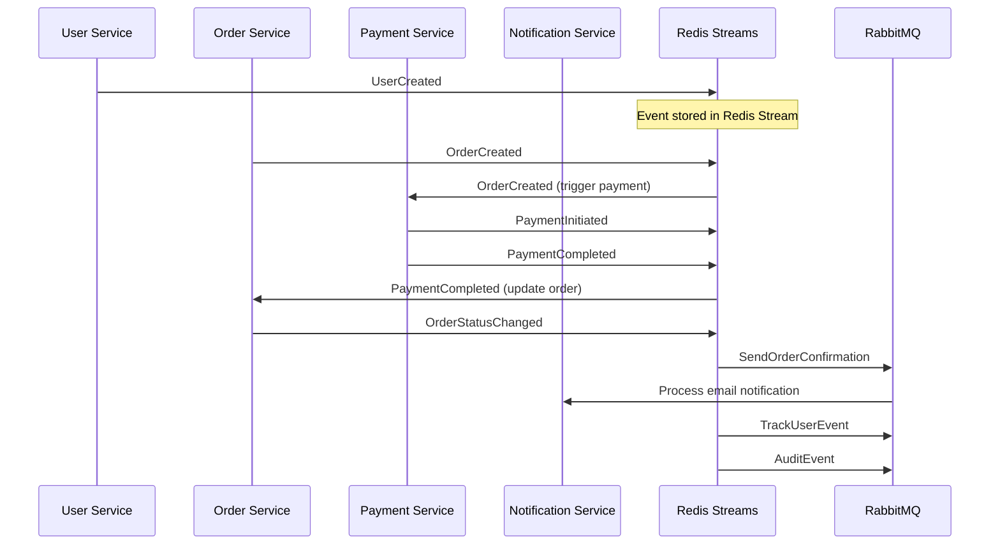
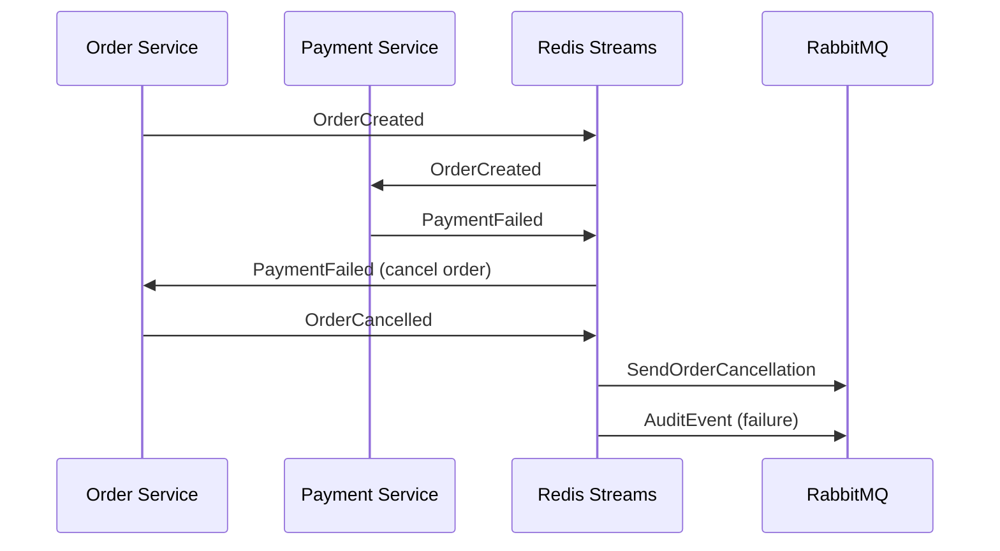

# Event Schemas Documentation

This document describes all event schemas used in the microservices communication example, including Redis Streams and RabbitMQ message formats.

## 📋 Overview

The system uses event-driven architecture with the following event transport mechanisms:
- **Redis Streams**: Real-time event bus for immediate notifications
- **RabbitMQ**: Reliable message queues for asynchronous processing
- **HTTP Webhooks**: Synchronous event notifications for critical operations

## 🏷️ Event Categories

### User Events
Events related to user lifecycle management

### Order Events  
Events for order processing and state management

### Payment Events
Events for payment processing and transaction management

### System Events
Infrastructure and monitoring events

---

## 📨 Redis Streams Events

### User Events

#### UserCreated
```json
{
  "eventType": "UserCreated",
  "eventId": "uuid-v4",
  "timestamp": "2024-01-15T10:30:00Z",
  "version": "1.0",
  "source": "user-service",
  "data": {
    "userId": "12345",
    "email": "user@example.com",
    "name": "John Doe",
    "createdAt": "2024-01-15T10:30:00Z",
    "status": "active"
  },
  "metadata": {
    "correlationId": "req-123",
    "causationId": "cmd-456",
    "traceId": "trace-789"
  }
}
```

#### UserUpdated
```json
{
  "eventType": "UserUpdated",
  "eventId": "uuid-v4", 
  "timestamp": "2024-01-15T10:35:00Z",
  "version": "1.0",
  "source": "user-service",
  "data": {
    "userId": "12345",
    "changes": {
      "name": {
        "from": "John Doe",
        "to": "John Smith"
      },
      "email": {
        "from": "john.doe@example.com",
        "to": "john.smith@example.com"
      }
    },
    "updatedAt": "2024-01-15T10:35:00Z",
    "updatedBy": "admin-001"
  },
  "metadata": {
    "correlationId": "req-124",
    "causationId": "cmd-457",
    "traceId": "trace-790"
  }
}
```

#### UserDeleted
```json
{
  "eventType": "UserDeleted",
  "eventId": "uuid-v4",
  "timestamp": "2024-01-15T10:40:00Z", 
  "version": "1.0",
  "source": "user-service",
  "data": {
    "userId": "12345",
    "deletedAt": "2024-01-15T10:40:00Z",
    "deletedBy": "admin-001",
    "reason": "user_requested"
  },
  "metadata": {
    "correlationId": "req-125",
    "causationId": "cmd-458", 
    "traceId": "trace-791"
  }
}
```

### Order Events

#### OrderCreated
```json
{
  "eventType": "OrderCreated",
  "eventId": "uuid-v4",
  "timestamp": "2024-01-15T11:00:00Z",
  "version": "1.0",
  "source": "order-service",
  "data": {
    "orderId": "order-67890",
    "userId": "12345",
    "items": [
      {
        "productId": "prod-001",
        "name": "Product A",
        "quantity": 2,
        "price": 29.99,
        "total": 59.98
      }
    ],
    "totalAmount": 59.98,
    "currency": "EUR",
    "status": "pending",
    "createdAt": "2024-01-15T11:00:00Z"
  },
  "metadata": {
    "correlationId": "req-126",
    "causationId": "cmd-459",
    "traceId": "trace-792"
  }
}
```

#### OrderStatusChanged
```json
{
  "eventType": "OrderStatusChanged",
  "eventId": "uuid-v4",
  "timestamp": "2024-01-15T11:05:00Z",
  "version": "1.0", 
  "source": "order-service",
  "data": {
    "orderId": "order-67890",
    "userId": "12345",
    "statusChange": {
      "from": "pending",
      "to": "confirmed",
      "reason": "payment_received",
      "changedAt": "2024-01-15T11:05:00Z"
    },
    "totalAmount": 59.98
  },
  "metadata": {
    "correlationId": "req-127",
    "causationId": "payment-confirmed-001",
    "traceId": "trace-792"
  }
}
```

#### OrderCancelled
```json
{
  "eventType": "OrderCancelled",
  "eventId": "uuid-v4",
  "timestamp": "2024-01-15T11:10:00Z",
  "version": "1.0",
  "source": "order-service", 
  "data": {
    "orderId": "order-67890",
    "userId": "12345",
    "cancelledAt": "2024-01-15T11:10:00Z",
    "reason": "customer_request",
    "refundAmount": 59.98,
    "refundRequired": true
  },
  "metadata": {
    "correlationId": "req-128",
    "causationId": "cmd-460",
    "traceId": "trace-793"
  }
}
```

### Payment Events

#### PaymentInitiated
```json
{
  "eventType": "PaymentInitiated",
  "eventId": "uuid-v4",
  "timestamp": "2024-01-15T11:02:00Z",
  "version": "1.0",
  "source": "payment-service",
  "data": {
    "paymentId": "pay-123456",
    "orderId": "order-67890", 
    "userId": "12345",
    "amount": 59.98,
    "currency": "EUR",
    "paymentMethod": "credit_card",
    "provider": "stripe",
    "status": "pending",
    "initiatedAt": "2024-01-15T11:02:00Z"
  },
  "metadata": {
    "correlationId": "req-126",
    "causationId": "order-created-001",
    "traceId": "trace-792"
  }
}
```

#### PaymentCompleted
```json
{
  "eventType": "PaymentCompleted",
  "eventId": "uuid-v4",
  "timestamp": "2024-01-15T11:05:00Z",
  "version": "1.0",
  "source": "payment-service",
  "data": {
    "paymentId": "pay-123456",
    "orderId": "order-67890",
    "userId": "12345", 
    "amount": 59.98,
    "currency": "EUR",
    "paymentMethod": "credit_card",
    "provider": "stripe",
    "providerTransactionId": "pi_1ABC123def456",
    "status": "completed",
    "completedAt": "2024-01-15T11:05:00Z",
    "fees": 1.74
  },
  "metadata": {
    "correlationId": "req-126",
    "causationId": "stripe-webhook-001",
    "traceId": "trace-792"
  }
}
```

#### PaymentFailed
```json
{
  "eventType": "PaymentFailed",
  "eventId": "uuid-v4",
  "timestamp": "2024-01-15T11:03:00Z",
  "version": "1.0",
  "source": "payment-service",
  "data": {
    "paymentId": "pay-123457",
    "orderId": "order-67891",
    "userId": "12346",
    "amount": 89.99,
    "currency": "EUR",
    "paymentMethod": "credit_card",
    "provider": "stripe",
    "status": "failed",
    "failedAt": "2024-01-15T11:03:00Z",
    "errorCode": "card_declined",
    "errorMessage": "Your card was declined",
    "retryable": true
  },
  "metadata": {
    "correlationId": "req-129",
    "causationId": "stripe-webhook-002", 
    "traceId": "trace-794"
  }
}
```

---

## 🐰 RabbitMQ Messages

### Email Notifications Queue

#### Send Welcome Email
```json
{
  "messageType": "SendWelcomeEmail",
  "messageId": "msg-uuid-v4",
  "timestamp": "2024-01-15T10:30:00Z",
  "priority": 5,
  "data": {
    "userId": "12345",
    "email": "user@example.com",
    "name": "John Doe",
    "template": "welcome",
    "language": "en",
    "variables": {
      "userName": "John",
      "activationLink": "https://app.example.com/activate/token123"
    }
  },
  "metadata": {
    "correlationId": "req-123",
    "retryCount": 0,
    "maxRetries": 3,
    "expiry": "2024-01-15T11:30:00Z"
  }
}
```

#### Send Order Confirmation
```json
{
  "messageType": "SendOrderConfirmation",
  "messageId": "msg-uuid-v4", 
  "timestamp": "2024-01-15T11:05:00Z",
  "priority": 7,
  "data": {
    "userId": "12345",
    "email": "user@example.com",
    "orderId": "order-67890",
    "template": "order_confirmation",
    "language": "en",
    "variables": {
      "orderNumber": "ORD-67890",
      "totalAmount": "€59.98",
      "items": [
        {
          "name": "Product A",
          "quantity": 2,
          "price": "€29.99"
        }
      ],
      "deliveryDate": "2024-01-18"
    }
  },
  "metadata": {
    "correlationId": "req-127",
    "retryCount": 0,
    "maxRetries": 3,
    "expiry": "2024-01-15T12:05:00Z"
  }
}
```

### Analytics Queue

#### Track User Event
```json
{
  "messageType": "TrackUserEvent",
  "messageId": "msg-uuid-v4",
  "timestamp": "2024-01-15T11:00:00Z",
  "priority": 3,
  "data": {
    "userId": "12345",
    "sessionId": "sess-789",
    "eventName": "order_created",
    "properties": {
      "orderId": "order-67890",
      "amount": 59.98,
      "currency": "EUR",
      "channel": "web",
      "userAgent": "Mozilla/5.0...",
      "ipAddress": "192.168.1.100"
    },
    "timestamp": "2024-01-15T11:00:00Z"
  },
  "metadata": {
    "correlationId": "req-126",
    "batchable": true,
    "retryCount": 0,
    "maxRetries": 5
  }
}
```

### Audit Log Queue

#### Audit Event
```json
{
  "messageType": "AuditEvent",
  "messageId": "msg-uuid-v4",
  "timestamp": "2024-01-15T11:05:00Z", 
  "priority": 8,
  "data": {
    "entityType": "Order",
    "entityId": "order-67890",
    "action": "status_change",
    "actorType": "system", 
    "actorId": "payment-service",
    "changes": {
      "status": {
        "from": "pending",
        "to": "confirmed"
      }
    },
    "timestamp": "2024-01-15T11:05:00Z",
    "ipAddress": "10.0.0.15",
    "userAgent": "payment-service/1.0"
  },
  "metadata": {
    "correlationId": "req-127",
    "retryCount": 0,
    "maxRetries": 5,
    "persistent": true
  }
}
```

---

## 🔄 Event Flow Examples

### Complete Order Flow



### Error Handling Flow



---

## 🏗️ Schema Validation

### Event Base Schema
All events must conform to this base structure:

```typescript
interface BaseEvent {
  eventType: string;           // Event type identifier
  eventId: string;            // Unique event ID (UUID v4)
  timestamp: string;          // ISO 8601 timestamp
  version: string;            // Schema version
  source: string;             // Originating service
  data: object;               // Event-specific data
  metadata: {
    correlationId: string;    // Request correlation
    causationId?: string;     // Causing event ID
    traceId?: string;         // Distributed trace ID
  };
}
```

### Message Base Schema
All RabbitMQ messages must conform to:

```typescript
interface BaseMessage {
  messageType: string;        // Message type identifier
  messageId: string;          // Unique message ID (UUID v4)
  timestamp: string;          // ISO 8601 timestamp
  priority: number;           // Message priority (1-10)
  data: object;               // Message-specific data
  metadata: {
    correlationId: string;    // Request correlation
    retryCount: number;       // Current retry attempt
    maxRetries: number;       // Maximum retry attempts
    expiry?: string;          // Message expiry time
    persistent?: boolean;     // Durability flag
    batchable?: boolean;      // Can be batched
  };
}
```

---

## 📊 Event Statistics

### Performance Metrics
- **Event Throughput**: ~1000 events/second per stream
- **Message Processing**: ~500 messages/second per queue
- **Latency**: 
  - Redis Streams: < 5ms P99
  - RabbitMQ: < 50ms P99
- **Durability**: All events persisted with configurable retention

### Error Rates
- **Event Processing**: < 0.1% error rate
- **Message Delivery**: < 0.01% failure rate (after retries)
- **Dead Letter Queue**: < 0.001% of total messages

---

## 🔧 Development Guidelines

### Event Design Principles

1. **Immutability**: Events should never be modified after creation
2. **Idempotency**: Event processing should be idempotent
3. **Versioning**: Include schema version for backward compatibility
4. **Correlation**: Always include correlation IDs for tracing
5. **Minimal Data**: Include only essential data in events

### Message Design Principles

1. **Reliability**: Use appropriate retry mechanisms
2. **Priority**: Set correct message priorities
3. **Expiry**: Set reasonable expiry times
4. **Batching**: Mark batchable messages appropriately
5. **Dead Letter**: Handle failed messages properly

### Testing Events

```bash
# Test event publishing
curl -X POST http://localhost:8001/users \
  -H "Content-Type: application/json" \
  -d '{"name": "Test User", "email": "test@example.com"}'

# Monitor Redis streams
redis-cli XREAD STREAMS user-events order-events payment-events $ $ $

# Monitor RabbitMQ queues  
rabbitmqctl list_queues name messages
```

---

## 📚 Related Documentation

- [API Documentation](./api-documentation.md)
- [Communication Patterns](./communication-patterns.md)
- [Monitoring Guide](../monitoring/README.md)
- [Testing Guide](../tests/README.md)

---

## 🆘 Troubleshooting

### Common Issues

**Events not appearing in Redis**
```bash
# Check Redis connection
redis-cli ping

# Check stream exists
redis-cli XINFO STREAM user-events
```

**Messages stuck in RabbitMQ**
```bash
# Check queue status
rabbitmqctl list_queues name messages consumers

# Purge queue if needed
rabbitmqctl purge_queue email-notifications
```

**Event processing delays**
```bash
# Check consumer lag
redis-cli XPENDING user-events user-service

# Monitor processing rates
curl http://localhost:9090/metrics | grep event_processing_rate
```
